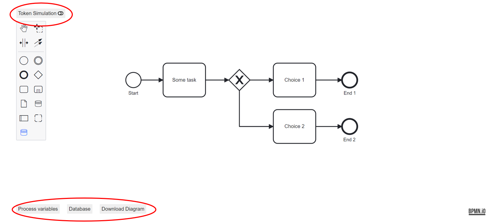
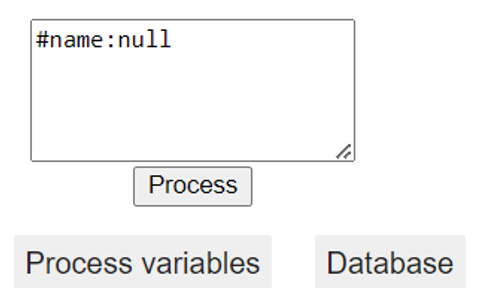
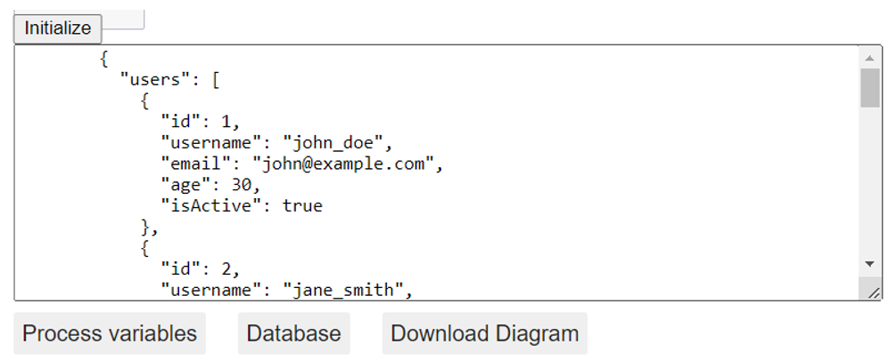
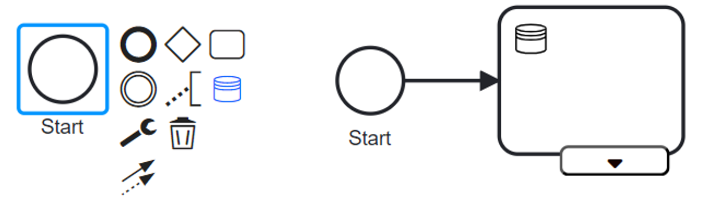
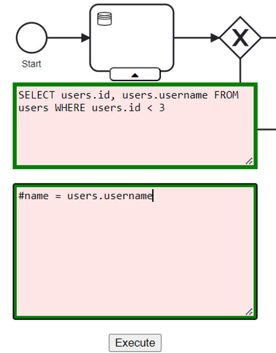
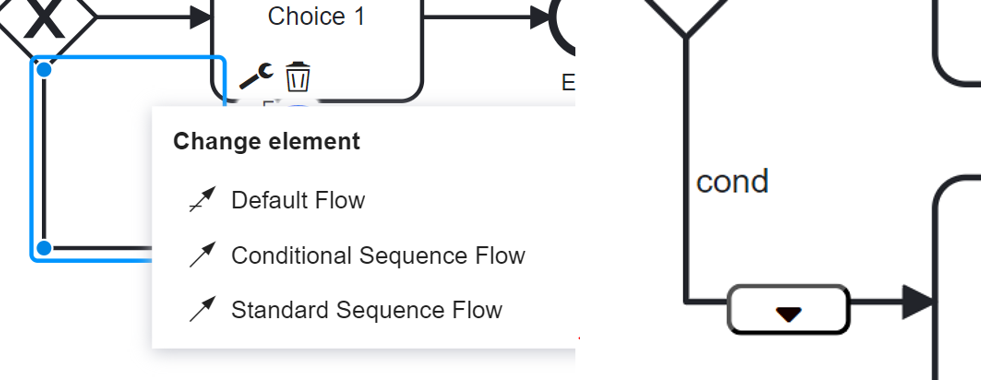
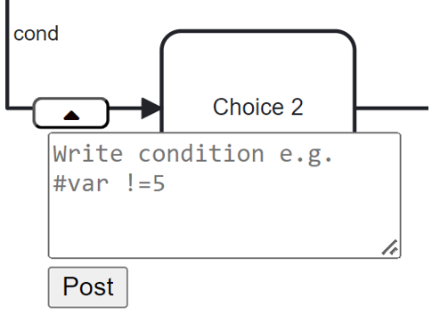

# Data-aware extension of bpmn.io

[](https://github.com/bpmn-io/bpmn-js-token-simulation/actions?query=workflow%3ACI)

A tool for modelling data-aware BPMN with simulation capablities, inspired by [delta-BPMN](https://link.springer.com/chapter/10.1007/978-3-030-85469-0_13) and built as a [bpmn-js](https://github.com/bpmn-io/bpmn-js) extension.


## Overview

Upon startup all the standard bpmn.io functions are avaliable and layout is the same as the standard bpmn.io, except these new buttons. 



The top button toggles between the modeler mode and the simulation mode. The bottom 3 buttons are for defining process variables, initiating the database, and downloading the diagram. The download button downloads a BPMN file, which can then be dragged and dropped into any modeler with this extension. The process variables button opens a text field where the user can define process variables in the format ‘#[variable name] : [value]’. The variable names must be unique, and the value can be a number or a string; no quotes are necessary. All variables must be separated with a semicolon.

<p align="left">
  
</p>


The database button, shows a simple textfield with a simple JSON-database file, this file can be altered to what ever is needed, this will later be where the user give the details for their actual database for initiation. If the JSON format is followed, then the database will be initated.  Modelling can now take place.


<p align="left">
  
</p>


## Turtorial
1. Use the small blue button in the bottom of the element menu to create a data task or open the element pallet by clicking on an element.

<p align="left">
  
</p>

2.	Click the dropdown menu button, in the bottom of the data task. This reveals the precondition and effect fields. Before writing make sure that the database if initiated, if not the parser will alert the user.

<p align="left">
  
</p>

3.	Now, begin writing either the preconditions or the effects. If no precondition is defined, the effects will immediately take hold when the task is executed. If you want to access any of the attributes in any table, write 'select' and press TAB. This will show every table. Then, write '.' and press TAB again to see every attribute in the table. If you already know the attributes needed and their table, write a normal SQL query, but it needs to be of the form 'SELECT A1,...,AN FROM R1,...,RN WHERE condition.' If ambiguous statements are written, the parser will not show the green outline. Ambiguity is solved by using the format Table.Attribute.

4.	Press the execute button to evaluate preconditions and perform the effects, or let the simulation do it.

## Simulation Capabilities

The simulation capabilities is build on top of an existing extension [bpmn-js-token-simulation](https://github.com/bpmn-io/bpmn-js-token-simulation). The simulation and the extension works together in two ways one is when a token reaches a data-aware component it triggers it and the second is when modelling, custom control flow can be defined. Custom control flow is added using the element menu by clicking on an edge. 

<p align="left">
  
</p>

Define a simple condition and append it using the POST button.

<p align="left">
  
</p>


## Clone, Build and Run

Start by cloning this project, then prepare the project by installing all dependencies using npm:

```sh
npm install
```

Then use the following command:

```sh

# spin up the example with server
npm run start:example2
```


## Links

* [delta-BPMN](https://link.springer.com/chapter/10.1007/978-3-030-85469-0_13) - The framework used as the foundation for this extension.
* [Token simulation](https://github.com/bpmn-io/bpmn-js-token-simulation) - More info about the simulator and its internals


## Licence

MIT
